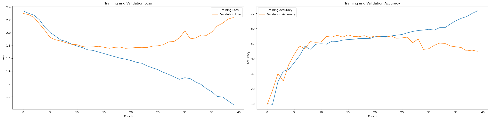

# Handwrtting Number Recognization based on LeNeT 
## Prework
Create your own virtural environment based on conda.
```bash
conda env create --name <your_env_name> python=3.11
```

Using pypi to install the package,we are highly recommend using tsinghua source.
```bash
pip install -r requirements.txt -i https://pypi.tuna.tsinghua.edu.cn/simple
```

## Train Model
We Training the model using **Tesla V100 16GB** in Google Colab for free,and make sure place the documents in correct place before running. 


Default setting epoch=40,and the training processing is as follows:

Obviously,model overfitting due to data scarcity.

## Test Output

you can see our output in **output** folder,using the index in Framework as follows.

## Framework

```
completed_Lenet_A+B/
│
├── model/                    # Model related files
│   ├── model_checkpoint.pth  # Model checkpoint file
│
├── A+B/                      # Dataset directory
│   ├── inputs/               # Test set
│   │   ├── images/           # Test images
│   ├── samples/              # Training set
│   │   ├── images/           # Training images
│   │   └── explantions/      # Training annotations
│   │   └── outputs/          # Training labels
│
├── Lenet_A+B.ipynb           # Source code
|
├── lenet_csv/                # Test outputs using csv
│   └── predications.csv      # Notebooks for data 
|
├── outputs/                # Test outputs using txt
│   └── 1.txt               # picture 1 predication
│   └── 2.txt               # picture 2 predication
│   └── ...
|
|analysis and prototype testing
│
├── requirements.txt          # Project dependencies
└── README.md                 # Project README file
```

- `model/`: Contains model weights and checkpoint files.
- `data/`: Stores datasets for training, validation, and potentially testing.
- `src/`: Source code for the project, including model definitions, training, and evaluation scripts.
- `notebooks/`: Jupyter notebooks for exploratory data analysis and code prototyping.
- `requirements.txt`: Lists all the Python libraries required for the project.
- `README.md`: Overview of the project, installation guide, and usage instructions.

## Additional Notes

- Adjust the descriptions according to the actual structure and contents of your project.
- Consider adding a `.gitignore` file to exclude unnecessary files (e.g., `.pyc` files, IDE settings).
- Include additional services like databases in the structure description if they are part of the project.
